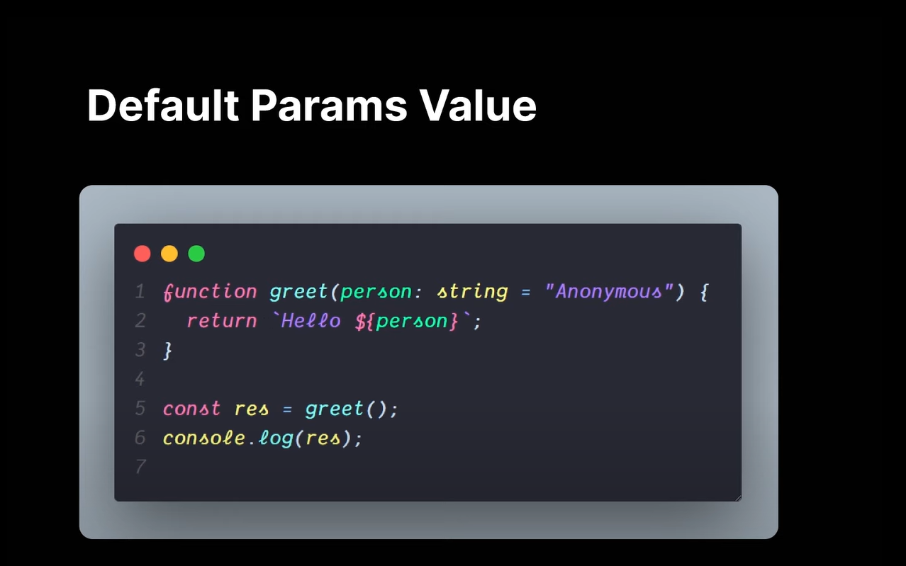

# Default Parameter Value

Default parameters in TypeScript allow you to specify a default value for a function parameter if one is not provided when the function is called.

Here's an example:

```ts
function greet(name: string = "world") {
  console.log(`Hello, ${name}!`);
}

greet(); // Output: "Hello, world!"
greet("Amith"); // Output: "Hello, HuXn!"
```

In this example, we declare a function greet that takes a single parameter name, which has a default value of 'world'. If the name parameter is not provided when the function is called, it will default to 'world'.

When we call greet() without any arguments, it outputs "Hello, world!". When we call greet('Amith'), it outputs "Hello, Amith".

